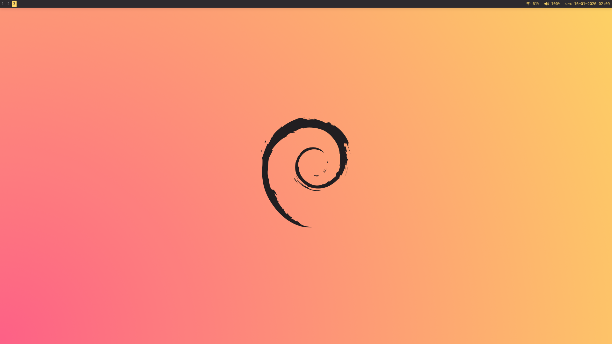

# Dotfiles – i3wm

Configurações pessoais para i3wm + Linux desktop.

## Preview



## Inclui
- alacritty
- dunst
- fastfetch
- i3
- i3status
- nano
- picom
- rofi

## Instalação

Execute script `bootstrap.sh` com o usuário normal para criar os links simbólicos para as devidas localizações de todos os arquivos de configuração (dotfiles) no diretório do usuário ($HOME).

```bash
git clone https://github.com/bsoliveira/dotfiles.git ~/dotfiles
cd ~/dotfiles
./bootstrap.sh
```

Deve conceder também permissão de execução para os scripts do i3 e Rofi
```bash
sudo chmod +x i3/scripts/*.sh
sudo chmod +x rofi/scripts/*.sh
```

### Requerimentos

```bash
sudo apt install alacritty autotiling dunst eza feh fastfetch fonts-cantarell htop lxappearance lxpolkit maim nano picom rofi xclip        
```

Fonte Utilizada `MesloLGM Nerd Font` (Requerida para os ícones do terminal, i3status e scripts do Rofi)
- Instalador fácil das fontes: https://github.com/officialrajdeepsingh/nerd-fonts-installer


## Recursos Utilizados
- Thema GTK: https://github.com/lassekongo83/adw-gtk3

- Icones: https://github.com/PapirusDevelopmentTeam/papirus-icon-theme

- Alterar Cores das pastas: https://github.com/PapirusDevelopmentTeam/papirus-folders

- Paleta de cores: https://monokai.pro/

- Rofi applets: https://github.com/adi1090x/rofi

- Nerd Fonts: https://www.nerdfonts.com

- Wallpapes: https://github.com/Henriquehnnm/Monokai-Pro-Wallpapers


## i3wm — Atalhos de Teclado Personalizados

**Mod:** `Super (Mod4)` Tecla Windows

### Apps
- `Mod + Enter` → Terminal (Alacritty)
- `Mod + d` → Launcher (Rofi)
- `Mod + b` → Firefox
- `Mod + e` → Thunar
- `Mod + c` → Bitwarden
- `Mod + Shift + p` → Screenshot (script Rofi)

### Janelas
- `Mod + Shift + q` → Fechar
- `Mod + f` → Fullscreen
- `Mod + Space` → Flutuante
- `Mod + ← ↓ ↑ →` → Mover foco
- `Mod + Shift + ← ↓ ↑ →` → Mover janela

### Layout
- `Mod + v` → Split vertical
- `Mod + s` → Split horizontal
- `Mod + r` → Resize  
  `← → ↑ ↓` redimensiona · `Enter / Esc` sai

### Workspaces
- `Mod + 1–5` → Ir para workspace
- `Mod + Shift + 1–5` → Mover janela

### Áudio
- `Mute` → Toggle mute
- `Vol − / +` → −5% / +5%

### Sessão
- `Mod + Shift + c` → Reload config
- `Mod + Shift + r` → Restart i3
- `Mod + Shift + e` → Power menu (script Rofi)


## GNU nano — Atalhos de Teclado Personalizados

- `Ctrl + X` → Recortar
- `Ctrl + C` → Copiar
- `Ctrl + V` → Colar
- `Ctrl + S` → Salvar
- `Ctrl + Q` → Sair do nano
- `Ctrl + Z` → Desfazer
- `Ctrl + Y` → Refazer
- `Ctrl + A` → Marcar seleção
- `Ctrl + T` → Ir para linha
- `Ctrl + /` → Comentar / Descomentar
- `Ctrl + H` → Abrir / fechar ajuda